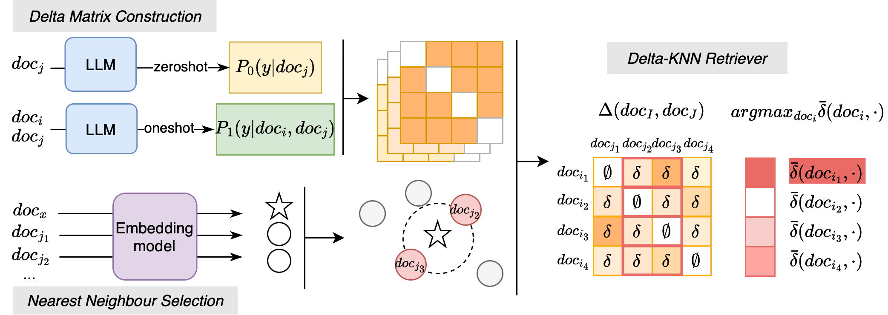

# Delta-KNN
Source code for the paper Delta-KNN: Improving Demonstration Selection in In-Context Learning for Alzheimer’s Disease Detection (ACL 2025).
<br>
<br>


## Setup
Please install [Pytorch](https://pytorch.org/get-started/locally/), [vLLM](https://pypi.org/project/vllm/) locally, then obtain access to the [ADReSS](https://talkbank.org/dementia/ADReSS-2020/) dataset, or put your personal dataset in ```data``` folder. 
We put some demo data in ```data/demo```. These two files come from the ADReSS dataset and are rephrased using [ChatGPT](https://chatgpt.com/).

## Usage
We use [vLLm](https://docs.vllm.ai/en/latest/) as the inference backend and [OpenAI API](https://openai.com/api/) to obtain the embeddings for calculating similarity. Run a vLLM server for [meta-llama/Llama-3.1-8B-Instruct](https://huggingface.co/meta-llama/Llama-3.1-8B-Instruct).
```
vllm serve meta-llama/Llama-3.1-8B-Instruct
```
Set up your [OpenAI API](https://openai.com/api/) key.
```
export OPENAI_API_KEY={YourKey}
```

### Zero-shot inference
To run zero-shot inference for a target document.
```
python3 inference.py data/demo/D001.json
```

### Few-shot inference with specific demonstration
To run few-shot inference for a document using one or more specific in-context learning examples, provide the demonstration file and its corresponding labels via the ```icls``` argument.
```
# One-shot
python3 inference.py data/demo/D001.json --icls data/demo/D002.json P

# Few-shot
python3 inference.py data/demo/D001.json --icls data/demo/D002.json P data/demo/D003.json H
```

### Few-shot inference with Delta-KNN
To run few-shot inference using our Delta-KNN in-context learning example selection method, a Delta Matrix built from a training set is required. 
We provide a pre-computed Delta Matrix based on the ADReSS train set. 
To use this matrix with our code, you must first obtain access to the [ADReSS](https://talkbank.org/dementia/ADReSS-2020/) dataset and place it in the ```data/adress-train``` directory.

```
python3 inference.py data/demo/D001.json --icls 4 --delta_matrix delta_matrix.pkl --train_set data/adress_train
```

### Delta Matrix construction
Coming soon...

### More Prompt formats
For additional prompt formats used in our paper, please refer to ```prompts.py```.

## Citation
To appear in ACL 2025

```
@article{li2025delta,
  title={Delta-KNN: Improving Demonstration Selection in In-Context Learning for Alzheimer's Disease Detection},
  author={Li, Chuyuan and Li, Raymond and Field, Thalia S and Carenini, Giuseppe},
  journal={arXiv preprint arXiv:2506.03476},
  year={2025}
}
```
