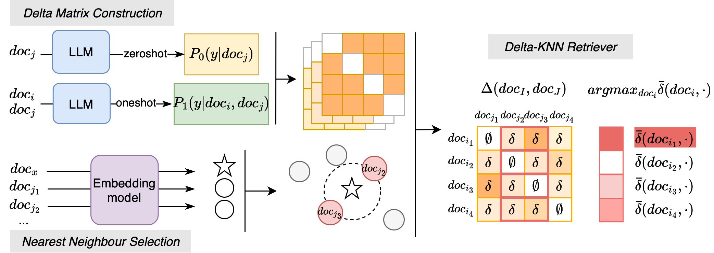

# Delta-KNN
Source code for the paper Delta-KNN: Improving Demonstration Selection in In-Context Learning for Alzheimer’s Disease Detection (ACL 2025).
<br>
<br>


## Setup
Please install [Pytorch](https://pytorch.org/get-started/locally/), [vLLM](https://pypi.org/project/vllm/) locally, then obtain access to the [ADReSS](https://talkbank.org/dementia/ADReSS-2020/) dataset, or put your personal dataset in ```data``` folder. 
We put some demo data in ```data/demo```. These two files come from the ADReSS dataset and are rephrased using [ChatGPT](https://chatgpt.com/).

## Usage
We use [vLLm](https://docs.vllm.ai/en/latest/) as the inference backend and [OpenAI API](https://openai.com/api/) to obtain the embeddings for calculating similarity. Run a vLLM server for [meta-llama/Llama-3.1-8B-Instruct](https://huggingface.co/meta-llama/Llama-3.1-8B-Instruct).
```
vllm serve meta-llama/Llama-3.1-8B-Instruct
```
Set up your [OpenAI API](https://openai.com/api/) key.
```
export OPENAI_API_KEY={YourKey}
```

### Zero-shot inference
To run zero-shot inference for a target document.
```
python3 inference.py data/demo/D001.json
```

### Few-shot inference with specific demonstration
To run few-shot inference for a document using one or more specific in-context learning examples, provide the demonstration file and its corresponding labels via the ```icls``` argument.
```
# One-shot
python3 inference.py data/demo/D001.json --icls data/demo/D002.json P

# Few-shot
python3 inference.py data/demo/D001.json --icls data/demo/D002.json P data/demo/D003.json H
```

### Few-shot inference with Delta-KNN
To run few-shot inference using our Delta-KNN in-context learning example selection method, a Delta Matrix built from a training set is required. 
We provide a pre-computed Delta Matrix based on the ADReSS train set. 
To use this matrix with our code, you must first obtain access to the [ADReSS](https://talkbank.org/dementia/ADReSS-2020/) dataset and place it in the ```data/adress-train``` directory.

```
python3 inference.py data/demo/D001.json --icls 4 --delta_matrix delta_matrix.pkl --train_set data/adress_train
```

### Delta Matrix construction
The Delta Matrix is constructed in `calculate_delta_matrix.py`. The selection workflow that uses this matrix is in `deltaknn.py`.

Script structure:
- `calculate_delta_matrix.py`: computes the Delta Matrix from processed zero-shot and exhaustive one-shot prediction files, and can average matrices across multiple runs before saving.
- `calculate_knn.py`: loads document embeddings and retrieves the `dk` nearest training examples for a target document.
- `deltaknn.py`: combines the KNN-selected neighbors with the Delta Matrix to rank candidate demonstrations and select the final in-context examples.

The current code expects two processed prediction files for the same document set:
- Zero-shot predictions in `prediction/{dataset}/{model}/{prompt}_0-shot/*_processed.json`
- Exhaustive one-shot predictions in `prediction/{dataset}/{model}/{prompt}_select-exhaustive_1-shot_5-fold/*_processed.json`
  - `{prompt}` is a user-defined identifier for the prompt format. It must be used consistently in your prediction filenames. For example, if your prompt combines `INST_SYS_ROLE_CTX_LING` and `INST_USR_PROB_COT_ANS` in `prompts.py`, you might name it `Sall-Ucot`.


The zero-shot `*_processed.json` file looks like this, where `E001` is the target example:

```
{
    "E001": [
        "P", // gold label
        "Here's the step-by-step classification process:...", // model raw output
        "P", // extracted predicted label
        0.7 // extracted predicted probability
    ],
}
```

The one-shot `*_processed.json` file looks like this, where `E001` is the target example and `E002` is the demonstration:
```
{
    "E001_E002": [
        "P",
        "Here's the step-by-step analysis: MODEL ANALTSIS AND PREDICTION...",
        [
            "E002"
        ],
        "P",
        0.8
    ],
}
```

For each ordered pair `(target_doc, demo_doc)`, the code computes:

```text
delta(target_doc, demo_doc) =
    one_shot_correct_class_score(target_doc, demo_doc)
    - zero_shot_correct_class_score(target_doc)
```

where:
- `correct_class_score = predicted_probability` if the predicted label matches the gold label
- `correct_class_score = 1 - predicted_probability` otherwise

If `target_doc == demo_doc`, the value is set to `NaN`.

The matrix returned by `calculate_delta_matrix()` is transposed before saving, so its shape is:
- rows: candidate demonstration documents
- columns: target documents

`doc_index` stores the document order used for both axes.

In the current implementation:
- `calculate_delta_matrix.py` builds and stores the matrix at `data/doc_delta/{dataset}/{model}/delta-1/`
- `deltaknn.py` loads that matrix, keeps only rows for the available training documents, then keeps only columns corresponding to the KNN-selected neighbors for the current test document
- the final demonstration ranking is based on the mean delta score across those selected columns

Embeddings are not used to construct the Delta Matrix itself. They are only used later by `calculate_knn.py` to select the `dk` nearest neighbors from:
- `data/embeddings/{dataset_train}/{embedding_model}/*.npy`
- `data/embeddings/{dataset_test}/{embedding_model}/*.npy`

Important implementation notes:
- We recommend running the zero-shot and exhaustive one-shot inference multiple times with different trial/seed settings, then averaging the resulting Delta Matrices. This helps mitigate model variation and makes the stored matrix more stable. The current `store_delta_matrix_and_index()` implementation already supports averaging multiple trial-seed pairs before saving.
- `prompt` in `calculate_delta_matrix.py` is currently a placeholder: `your_prompt_id`. Set it to the same identifier used in your 0-shot and 1-shot prediction filenames.
- `embedding_model` in `calculate_knn.py` is currently a placeholder: `your_embedding_model_name`
- the example code in `deltaknn.py` is currently specialized for the ADReSS naming convention, where patient files start with `E` and healthy control files start with `H`
- dataset/path naming is not fully standardized in the repo yet: the code uses `adress-train` as the dataset name, while raw files are read from `adress_train_raw`


### More Prompt formats
For additional prompt formats used in our paper, please refer to ```prompts.py```.

## Citation

```
@inproceedings{li-etal-2025-delta,
    title = "Delta-{KNN}: Improving Demonstration Selection in In-Context Learning for {A}lzheimer{'}s Disease Detection",
    author = "Li, Chuyuan  and
      Li, Raymond  and
      Field, Thalia S.  and
      Carenini, Giuseppe",
    editor = "Che, Wanxiang  and
      Nabende, Joyce  and
      Shutova, Ekaterina  and
      Pilehvar, Mohammad Taher",
    booktitle = "Proceedings of the 63rd Annual Meeting of the Association for Computational Linguistics (Volume 1: Long Papers)",
    month = jul,
    year = "2025",
    address = "Vienna, Austria",
    publisher = "Association for Computational Linguistics",
    url = "https://aclanthology.org/2025.acl-long.1253/",
    doi = "10.18653/v1/2025.acl-long.1253",
    pages = "25807--25826",
    ISBN = "979-8-89176-251-0",
}
```
